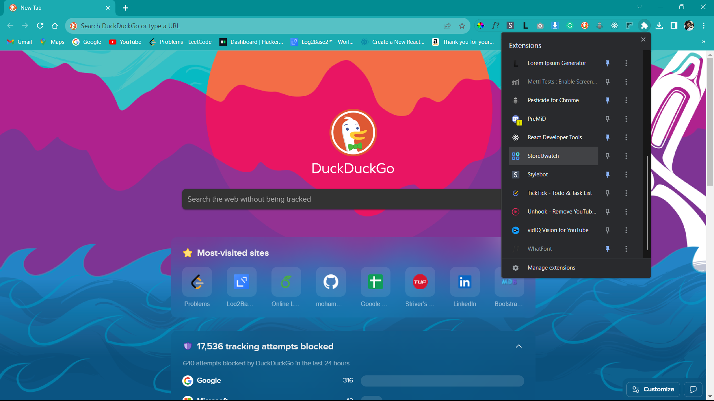
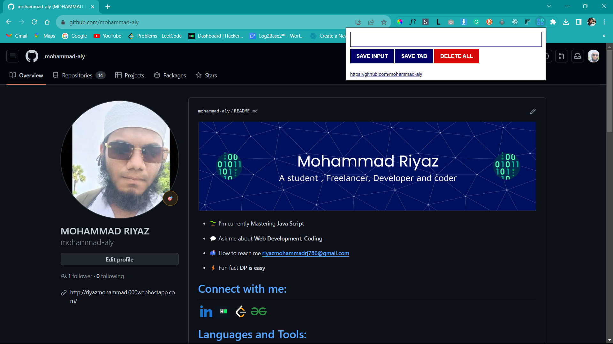
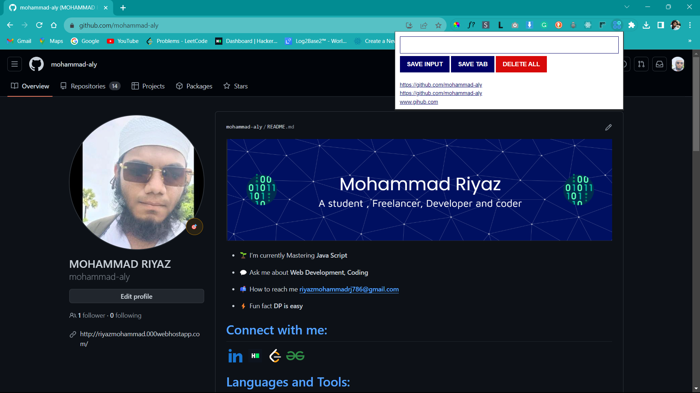

# Remember-U-visited
This is a Chrome extension Application, you can now store the web addresses / URLs or any text of the tabs that u visited and can manipulate them as your stores...

<h2>1. we will find the extension icon in the browser as shown in figure  
don't be confused about the name I forgot to change the name of the extension</h2>

<h2>2. Go to any page that you need and open the extension. Now press the <b>SAVE TAB</b> button to save the URL of the page</h2>

<h2>3. If we want to store any text manually then you can type manually in to the text box and press the <b>SAVE INPUT</b> button</h2>

<h2>4. We can also delete data in the box by pressing the <b>DELETE ALL</b> button</h2>

<h3><b>Thank you🫡</b> for going through my repo . This is my project which I developed while learning Java script .....</h3>

<h2>GIVE THAT STAR🌟 TO REPO IF YOU LIKE 😊</h2>

